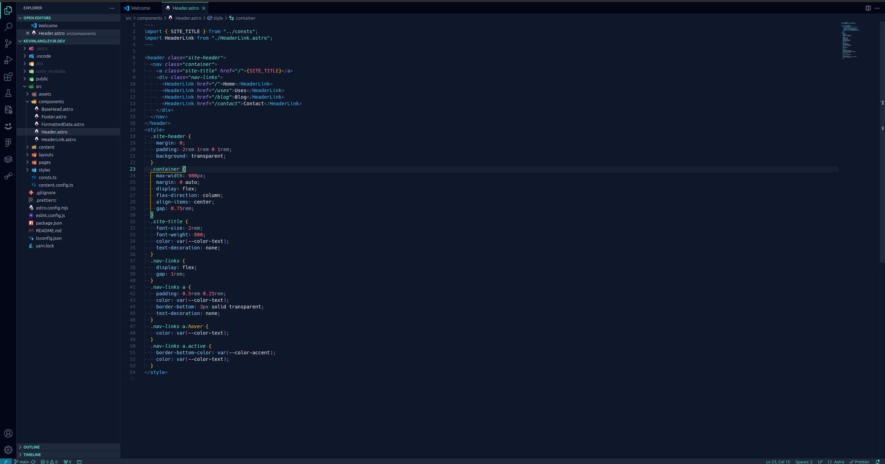

<div align="center">


<picture>
  <source media="(prefers-color-scheme: dark)" srcset="https://getslatewave.com/brand/wordmark-light.png">
  
</picture>

# Slatewave (VSCode)

[](https://marketplace.visualstudio.com/items?itemName=kevinlangleyjr.slatewave)
[](https://marketplace.visualstudio.com/items?itemName=kevinlangleyjr.slatewave)

A dark [VSCode](https://code.visualstudio.com) theme built around a slate foundation and a teal signature, with sky/rose/purple/amber accents. Part of the [Slatewave family](#slatewave-family) — one palette across editors, terminals, prompts, notes, and more.

> _Slate below, teal above._



</div>

---

## Palette

### Foundation — slate

The editor, sidebar, and panels all live in the slate scale. Five steps, darkest to lightest.

| | Hex | Tailwind | Where |
|---|---|---|---|
|  | `#020617` | slate-950 | activity bar, tab strip |
|  | `#0f172a` | slate-900 | editor, sidebar, terminal |
|  | `#1e293b` | slate-800 | inputs, status bar, menus |
|  | `#334155` | slate-700 | list focus, borders |
|  | `#475569` | slate-600 | gutter, ignored files |

### Text — slate (inverse)

| | Hex | Tailwind | Where |
|---|---|---|---|
|  | `#64748b` | slate-500 | comments |
|  | `#94a3b8` | slate-400 | operators, muted UI |
|  | `#cbd5e1` | slate-300 | parameters, properties |
|  | `#e2e8f0` | slate-200 | default foreground |
|  | `#f1f5f9` | slate-100 | bright ANSI white |

### Signature — teal

The "wave" in Slatewave. Used as the primary accent across the editor and the companion prompt.

| | Hex | Tailwind | Where |
|---|---|---|---|
|  | `#0f766e` | teal-700 | debugging status bar, buttons |
|  | `#5eead4` | teal-300 | **primary accent** — cursor, active tab, strings, prompt |
|  | `#99f6e4` | teal-200 | types, classes, interfaces |
|  | `#ecfeff` | cyan-50 | text on teal/cyan backgrounds |

### Accents

Each accent maps to a specific role in both the prompt and the editor, so the terminal and editor speak the same visual language.

| | Hex | Role in prompt | Role in editor |
|---|---|---|---|
|  | `#38bdf8` | git clean branch | keywords, tags, info diagnostics, links |
|  | `#7dd3fc` | — | functions, JSON/YAML keys, CSS props |
|  | `#B388FF` | git ahead / behind | storage (`const`/`let`/`function`), `this`/`self`, decorators-adjacent |
|  | `#fb7185` | git dirty (working/staging) | numbers, constants, modified files, errors |
|  | `#fbbf24` | — | decorators, escape chars, warnings |
|  | `#b45309` | battery discharging | warning status bar, deprecated |
|  | `#0e7490` | battery charging | remote status bar |
|  | `#ff4500` | git diverged | merge conflicts |
|  | `#ef5350` | exit code != 0 | deleted files, invalid syntax |

---

## Syntax mapping

| Token | | Color | Style |
|---|---|---|---|
| Comments |  | `#64748b` | italic |
| Keywords (`if`, `return`, `import`) |  | `#38bdf8` | — |
| Storage (`const`, `let`, `function`, `class`) |  | `#B388FF` | italic |
| Types / classes / interfaces |  | `#99f6e4` | — |
| Functions (calls + definitions) |  | `#7dd3fc` | — |
| Strings |  | `#5eead4` | — |
| Numbers, booleans, `null`, `undefined` |  | `#fb7185` | — |
| Constants (`UPPER_SNAKE`) |  | `#fb7185` | — |
| Regex |  | `#fb7185` | — |
| Escape sequences |  | `#fbbf24` | — |
| Decorators / annotations |  | `#fbbf24` | italic |
| `this` / `self` / `super` |  | `#B388FF` | italic |
| Parameters |  | `#cbd5e1` | italic |
| Properties / object keys |  | `#cbd5e1` | — |
| Operators, punctuation |  | `#94a3b8` | — |
| HTML/JSX tags |  | `#38bdf8` | — |
| HTML/JSX attributes |  | `#B388FF` | italic |
| CSS selectors |  | `#5eead4` | — |
| CSS properties |  | `#7dd3fc` | — |
| CSS custom properties (`--var`) |  | `#B388FF` | — |
| CSS pseudo selectors |  | `#fbbf24` | — |
| Markdown headings |  | `#5eead4` | bold |
| Markdown links |  | `#38bdf8` | underline |
| Markdown inline code |  | `#99f6e4` | — |
| Diff inserted |  | `#5eead4` | — |
| Diff deleted |  | `#fb7185` | — |

Semantic highlighting is enabled; declarations render **bold**, deprecated symbols render ~~strikethrough~~.

---

## Terminal

The integrated terminal's ANSI palette is wired to the prompt's segment colors, so the companion oh-my-posh theme renders identically in VSCode and any outside terminal.

| ANSI | Hex | |
|---|---|---|
| black | `#1e293b` |  |
| red | `#fb7185` |  |
| green | `#5eead4` |  |
| yellow | `#b45309` |  |
| blue | `#38bdf8` |  |
| magenta | `#B388FF` |  |
| cyan | `#0e7490` |  |
| white | `#e2e8f0` |  |

Bright variants follow the same mapping, shifted one step up the scale.

---

## Installation

### From the Marketplace

Install **[Slatewave](https://marketplace.visualstudio.com/items?itemName=kevinlangleyjr.slatewave)** from the VS Code Marketplace, or from the CLI:

```sh
code --install-extension kevinlangleyjr.slatewave
```

Then open the theme picker (`⌘K ⌘T` / `Ctrl+K Ctrl+T`) and choose **Slatewave**.

### From a local clone

```sh
git clone https://github.com/kevinlangleyjr/vscode-slatewave.git \
  ~/.vscode/extensions/kevinlangleyjr.slatewave-0.0.1
```

Reload VSCode, then open the theme picker (`⌘K ⌘T` / `Ctrl+K Ctrl+T`) and choose **Slatewave**.

### From a `.vsix`

```sh
vsce package
code --install-extension slatewave-0.0.1.vsix
```

---

## Slatewave family

One palette. Every tool.

- **Editors** — [Neovim](https://github.com/kevinlangleyjr/neovim-slatewave) · [Helix](https://github.com/kevinlangleyjr/helix-slatewave) · [Zed](https://github.com/kevinlangleyjr/zed-slatewave) · [Sublime Text](https://github.com/kevinlangleyjr/sublime-text-slatewave) · [JetBrains](https://github.com/kevinlangleyjr/jetbrains-slatewave)
- **Terminals** — [Alacritty](https://github.com/kevinlangleyjr/alacritty-slatewave) · [Ghostty](https://github.com/kevinlangleyjr/ghostty-slatewave) · [iTerm2](https://github.com/kevinlangleyjr/iterm2-slatewave) · [WezTerm](https://github.com/kevinlangleyjr/wezterm-slatewave) · [Windows Terminal](https://github.com/kevinlangleyjr/windows-terminal-slatewave) · [Kitty](https://github.com/kevinlangleyjr/kitty-slatewave)
- **Prompts** — [Oh My Posh](https://github.com/kevinlangleyjr/slatewave-omp) · [Starship](https://github.com/kevinlangleyjr/starship-slatewave)
- **Multiplexer** — [tmux](https://github.com/kevinlangleyjr/tmux-slatewave)
- **CLI** — [LSD](https://github.com/kevinlangleyjr/lsd-slatewave)
- **Notes** — [Obsidian](https://github.com/kevinlangleyjr/obsidian-slatewave) · [Logseq](https://github.com/kevinlangleyjr/logseq-slatewave) · [MarkEdit](https://github.com/kevinlangleyjr/markedit-slatewave) · [Anytype](https://github.com/kevinlangleyjr/anytype-slatewave)
- **Launchers** — [Alfred](https://github.com/kevinlangleyjr/alfred-slatewave) · [Raycast](https://github.com/kevinlangleyjr/raycast-slatewave)
- **Chat** — [Slack](https://github.com/kevinlangleyjr/slack-slatewave)

See [getslatewave.com](https://getslatewave.com) for the full family.
---

## Customize

To override a specific color without forking the theme, add to your `settings.json`:

```jsonc
{
  "workbench.colorTheme": "Slatewave",
  "workbench.colorCustomizations": {
    "[Slatewave]": {
      "editor.background": "#0a0f1e",
      "editorCursor.foreground": "#99f6e4"
    }
  },
  "editor.tokenColorCustomizations": {
    "[Slatewave]": {
      "comments": "#475569"
    }
  }
}
```

The `[Slatewave]` scope ensures your overrides only apply when this theme is active.

---

## Contributing

Issues and PRs welcome. If you're proposing a palette change, please include a before/after screenshot of the same file so the visual tradeoff is obvious.

---

## License

WTFPL – Do What The Fuck You Want To Public License. See [LICENSE](LICENSE).
